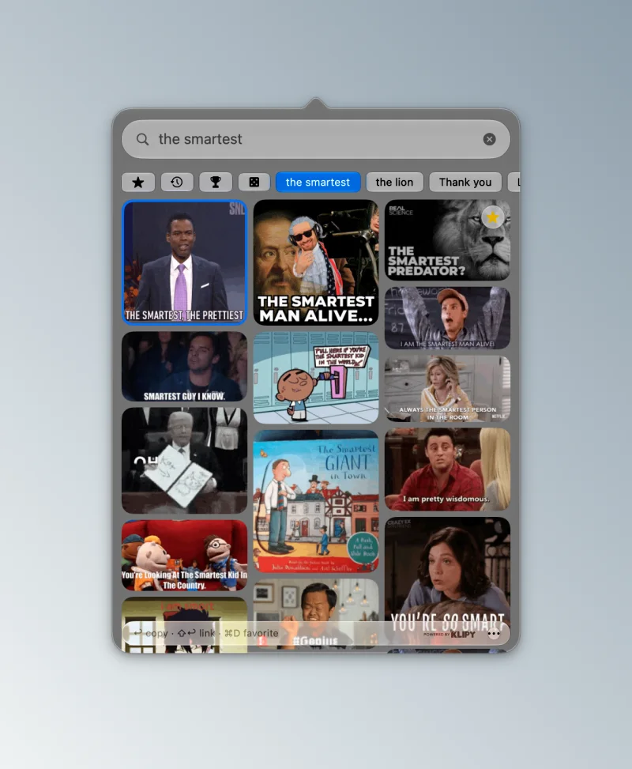
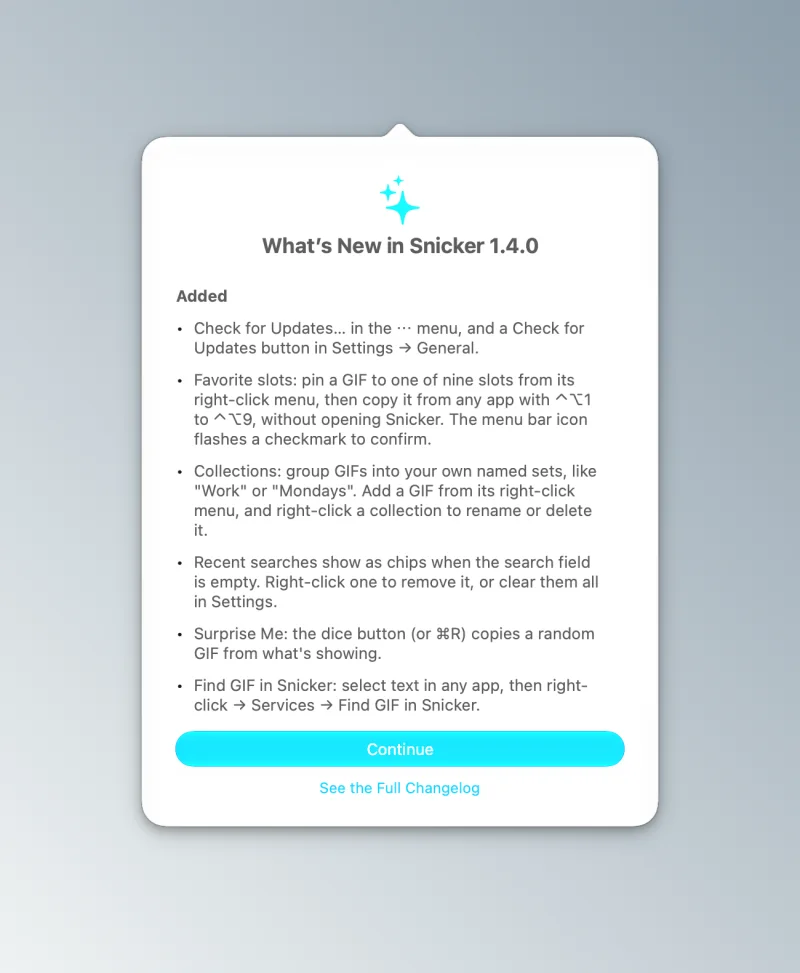
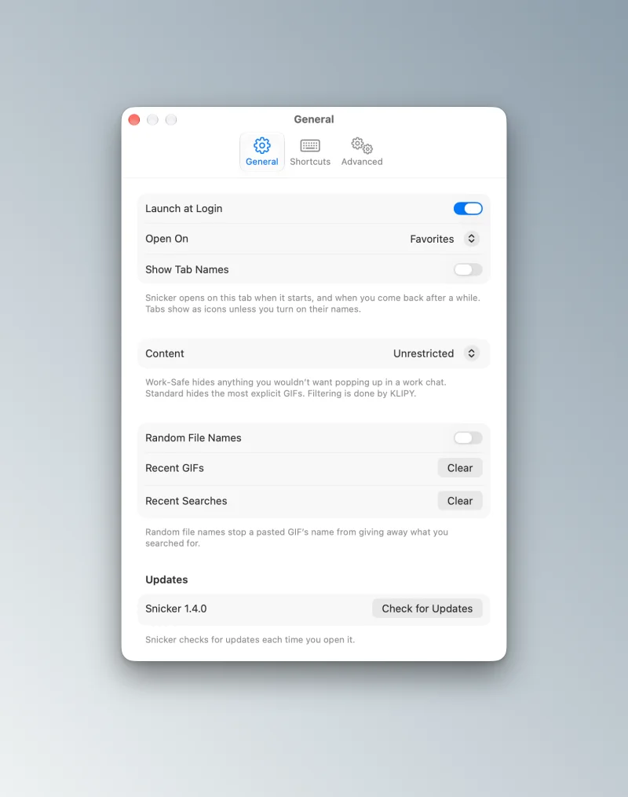
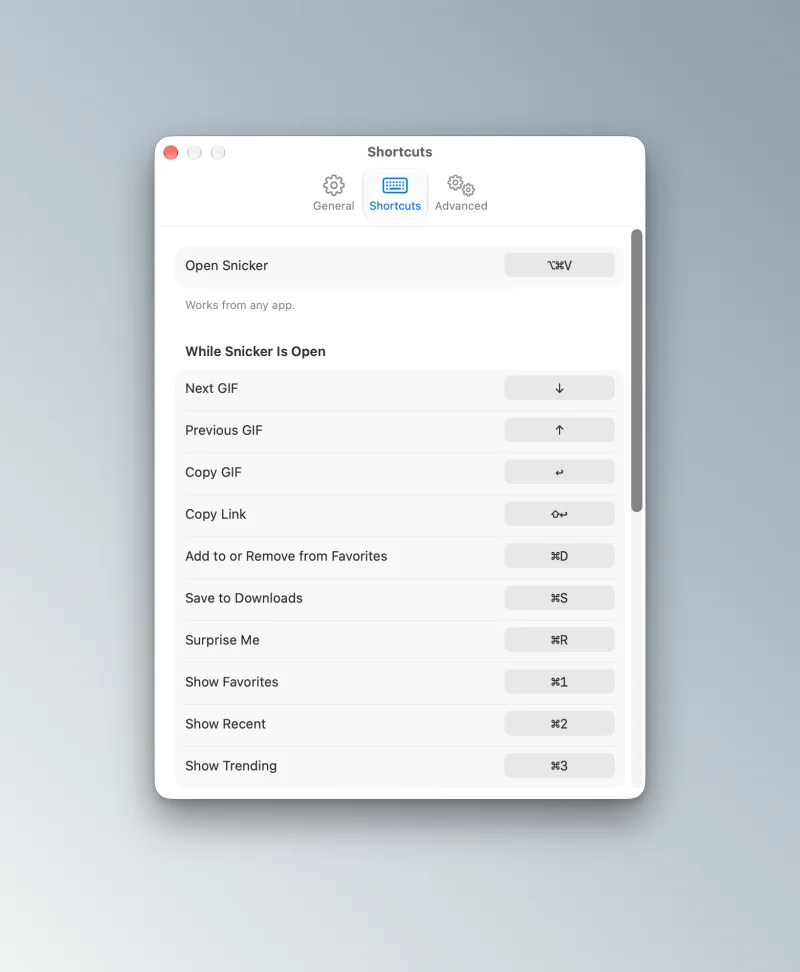
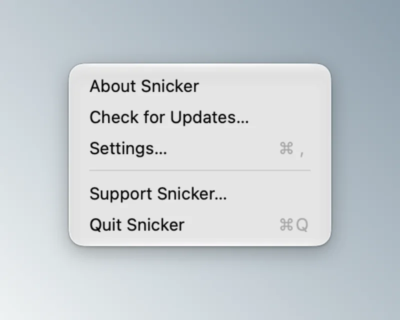
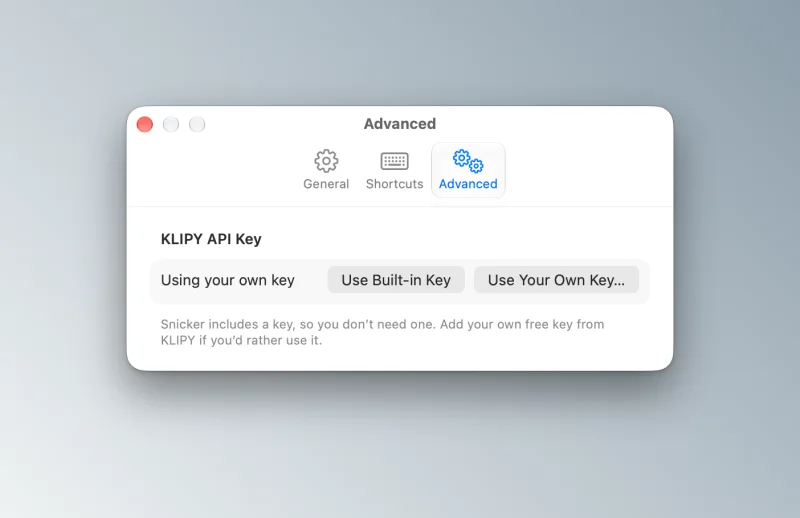

<p align="center">
  
</p>

<h1 align="center">Snicker</h1>

<p align="center">
  <strong>GIF search in your Mac menu bar.</strong><br>
  Press <kbd>⌘</kbd> <kbd>⌥</kbd> <kbd>V</kbd>, find the perfect reaction, and paste it anywhere.
</p>

<p align="center">
  <a href="https://github.com/Luis-Sejer/snicker-gif/releases/latest"></a>
  
  
  
  
  <a href="LICENSE"></a>
  <a href="https://github.com/Luis-Sejer/snicker-gif/actions/workflows/ci.yml"></a>
</p>

<p align="center">
  <a href="https://github.com/Luis-Sejer/snicker-gif/releases/latest/download/Snicker.zip"></a>
  <br>
  <a href="https://luis-sejer.github.io/snicker-gif/"><strong>luis-sejer.github.io/snicker-gif</strong></a>, try the live demo in your browser
</p>

<p align="center">
  
  <br>
  <sub>▶ <a href="https://luis-sejer.github.io/snicker-gif/#watch">Watch the launch video with sound</a></sub>
  <br>
  <sub>The animation, the video and the site's live demo are mock-ups that use emoji in place of GIFs. The real app shows real GIFs from KLIPY, as in the screenshot below.</sub>
</p>

<p align="center">
  
  <br>
  <sub>The real app: searching for “Download it”.</sub>
</p>

## Why Snicker

Press <kbd>⌘</kbd> <kbd>⌥</kbd> <kbd>V</kbd> from any app, type what you’re after, and click. The GIF is on your clipboard before the conversation moves on.

It is small and quiet: a native SwiftUI app of about 2 MB, with no account, no setup, no Dock icon, and nothing to do until you press the shortcut. And it pastes where other GIF pickers don’t, including Microsoft Teams.

## Features

- Search from any app with <kbd>⌘</kbd> <kbd>⌥</kbd> <kbd>V</kbd>. Trending shows up before you type.
- Click a GIF to copy it, or drag it straight into another app.
- Paste into Teams, Slack, Discord, Messages or Mail.
- Favorites and Recent are one click away and survive a restart, and collections group GIFs your way.
- Pin favorites to nine slots and copy them from any app with <kbd>⌃</kbd> <kbd>⌥</kbd> <kbd>1</kbd>–<kbd>9</kbd>, without opening Snicker.
- Select text in any app and choose **Services → Find GIF in Snicker**.
- Recent searches are one click away, and the dice copies a random GIF when you can't decide.
- Choose how strictly results are filtered: Unrestricted, Standard or Work-Safe.
- Suggestions appear as you type, and there are quick picks for common reactions.
- Right-click a GIF to copy its link (handy in chats that unfurl links) or save it to Downloads.
- Use the arrow keys to choose, <kbd>Return</kbd> to copy and <kbd>⌘</kbd> <kbd>D</kbd> to favorite.
- The grid shows every GIF at its real shape, animated.
- Launch at Login keeps it ready, and Random File Names stops pasted files from giving away your search.
- Every keyboard shortcut can be remapped in Settings, and you choose whether Snicker opens on Trending, Favorites, Recent, Emoji or whatever you used last.
- An optional emoji picker to use instead of Apple’s Emoji & Symbols: <kbd>⌃</kbd> <kbd>⌘</kbd> <kbd>Space</kbd> (or a shortcut you choose) opens Snicker at the text cursor and types the emoji you pick. Every emoji your Mac can draw, in Apple’s categories, searchable by name or keyword, with skin tones on right-click. Turn it on under Settings → General → Emoji Picker.
- The Liquid Glass design fits right in on macOS Tahoe and later.
- It works with VoiceOver, the keyboard, Reduce Motion and Auto-play Animated Images.

## A closer look

<table>
  <tr>
    <td width="50%"></td>
    <td width="50%"></td>
  </tr>
  <tr>
    <td align="center"><sub>Search, tabs, the dice and your recent searches</sub></td>
    <td align="center"><sub>What's new, right after an update</sub></td>
  </tr>
  <tr>
    <td></td>
    <td></td>
  </tr>
  <tr>
    <td align="center"><sub>General settings</sub></td>
    <td align="center"><sub>Every shortcut, remappable</sub></td>
  </tr>
  <tr>
    <td></td>
    <td></td>
  </tr>
  <tr>
    <td align="center"><sub>Right-click the menu bar icon</sub></td>
    <td align="center"><sub>Bring your own KLIPY key, if you like</sub></td>
  </tr>
</table>

## Install

Paste this into Terminal:

```sh
curl -fsSL https://raw.githubusercontent.com/Luis-Sejer/snicker-gif/main/install.sh | sh
```

It installs Snicker and opens it. When a new version is out, Snicker tells you and updates itself with one click.

Every release is built by [GitHub Actions](.github/workflows/release.yml) straight from the tagged source, so what you download is exactly what is in this repository.

<details>
<summary><strong>Install by hand</strong></summary>

1. Download [`Snicker.zip`](https://github.com/Luis-Sejer/snicker-gif/releases/latest/download/Snicker.zip) and unzip it.
2. Move `Snicker.app` to your Applications folder.
3. Open it. macOS will say it can’t verify the developer, because Snicker isn’t notarized with a paid Apple developer account.
4. Open **System Settings → Privacy & Security**, scroll down and click **Open Anyway**.

</details>

### Install with your AI agent

Using Claude Code, Codex, Cursor or another coding agent? Give it this:

```text
Install Snicker on this Mac and check it works, following
https://github.com/Luis-Sejer/snicker-gif/blob/main/docs/install/agent.md
```

It checks your Mac can run Snicker, installs it and tells you how to use it. Ask it to uninstall Snicker the same way.

### Uninstall

```sh
curl -fsSL https://raw.githubusercontent.com/Luis-Sejer/snicker-gif/main/install.sh | sh -s -- --uninstall
```

This removes the app and its GIF cache. Your favorites and settings stay, in case you come back. To remove them too, run `defaults delete dk.sejer.snicker`.

## Getting started

Press <kbd>⌘</kbd> <kbd>⌥</kbd> <kbd>V</kbd> or click the **GIF** icon in the menu bar, and start typing. There is nothing to set up and no account to create. Prefer other keys? Change any shortcut under **Settings → Shortcuts** (<kbd>⌘</kbd> <kbd>,</kbd>).

To have Snicker start with your Mac, turn on **Launch at Login** in Settings. Open Settings from the ⋯ menu, by right-clicking the menu bar icon, or with <kbd>⌘</kbd> <kbd>,</kbd>.

## Usage

| Do this | To |
|---|---|
| <kbd>⌘</kbd> <kbd>⌥</kbd> <kbd>V</kbd> or click the menu bar icon | open or close Snicker |
| Type, or pick a suggestion | search (empty shows Trending) |
| <kbd>↑</kbd> <kbd>↓</kbd> | choose a GIF |
| <kbd>Return</kbd> | copy the chosen GIF |
| <kbd>⇧</kbd> <kbd>Return</kbd> | copy its link |
| <kbd>⌘</kbd> <kbd>D</kbd> | add it to or remove it from Favorites |
| <kbd>⌘</kbd> <kbd>S</kbd> | save it to Downloads |
| <kbd>⌘</kbd> <kbd>1</kbd> <kbd>2</kbd> <kbd>3</kbd> | show Favorites, Recent or Trending |
| <kbd>⌘</kbd> <kbd>4</kbd> | show Emoji, once the emoji picker is on |
| <kbd>⌃</kbd> <kbd>⌘</kbd> <kbd>Space</kbd>, from any app | open at the text cursor and type the emoji you pick, once the emoji picker is on |
| <kbd>⌘</kbd> <kbd>R</kbd> | copy a random GIF |
| <kbd>⌃</kbd> <kbd>⌥</kbd> <kbd>1</kbd>–<kbd>9</kbd>, from any app | copy the GIF pinned to that slot |
| Click a GIF | copy it and close |
| Drag a GIF | drop it into any app |
| Right-click a GIF | Copy GIF, Copy Link, Favorites, Save to Downloads, Open on KLIPY |

Every keyboard shortcut here can be changed under **Settings → Shortcuts**.

Launch at Login, Random File Names and the other settings are in the ⋯ menu at the bottom right.

## How pasting works

When you copy a GIF, Snicker downloads it to `~/Library/Caches/Snicker` and writes two things to the clipboard. Only the GIF you copied last is kept there; the rest are deleted.

| Clipboard type | For apps that |
|---|---|
| A file URL pointing at the `.gif` | expect a file, like Microsoft Teams |
| The raw GIF data (`com.compuserve.gif`) | take image data, like Slack and Discord |

Each app picks the one it understands, so the GIF stays animated wherever you paste it.

## Accessibility

Snicker is built to work for everyone:

- VoiceOver reads each GIF by its title, says when something is copied, and offers Copy Link, Favorites and Save to Downloads as actions.
- You can search, choose, copy, copy the link and favorite without touching the mouse.
- Reduce Motion turns off the hover zoom and the bouncy effects.
- If Auto-play Animated Images is off, a GIF only plays while you point at it or select it.
- Increase Contrast and Reduce Transparency work automatically, because Snicker uses the system’s Liquid Glass materials.

Found something that doesn’t work with your setup? Please [open an issue](https://github.com/Luis-Sejer/snicker-gif/issues/new/choose).

## Privacy

- Your searches go to KLIPY to find GIFs, and nowhere else.
- When you open Snicker, it asks GitHub whether a new version is out. Nothing about you is sent.
- Favorites, recents, settings and any KLIPY key you add are stored locally in Snicker’s preferences.
- No analytics, no tracking, no account.

<details>
<summary><strong>Build from source</strong></summary>

You need macOS 26 or later and the Xcode Command Line Tools (`xcode-select --install`). Full Xcode is not required.

```sh
git clone https://github.com/Luis-Sejer/snicker-gif.git
cd snicker-gif
./build.sh install
```

Source builds ask for your own free KLIPY key on first launch; get one from KLIPY’s [developer portal](https://docs.klipy.com).

| Script | What it does |
|---|---|
| `./build.sh` | builds `build/Snicker.app` |
| `./build.sh install` | builds, installs to `~/Applications` and launches |
| `./release.sh 1.4.0` | tags a release; GitHub Actions builds and publishes it |
| `docs/src/render.sh` | re-renders the icon, README artwork and launch video |

</details>

Ideas that aren't planned yet live in the [roadmap](ROADMAP.md).

## Contributing

Bug reports, ideas and pull requests are welcome. See [CONTRIBUTING.md](CONTRIBUTING.md) to get started, and the [changelog](CHANGELOG.md) for what’s new.

## Support

Snicker is free and open source. If it makes your chats better, you can [buy me a coffee on Ko-fi](https://ko-fi.com/snickerapp), or pick **Support Snicker…** from the app’s ⋯ menu.

## Credits

GIFs are provided by [KLIPY](https://klipy.com). Launch video voiceover and sound effects by [ElevenLabs](https://elevenlabs.io). Inspired by [QuickGif](https://quickgif.app).

## License

[MIT](LICENSE) © Luis Sejer Oliver
